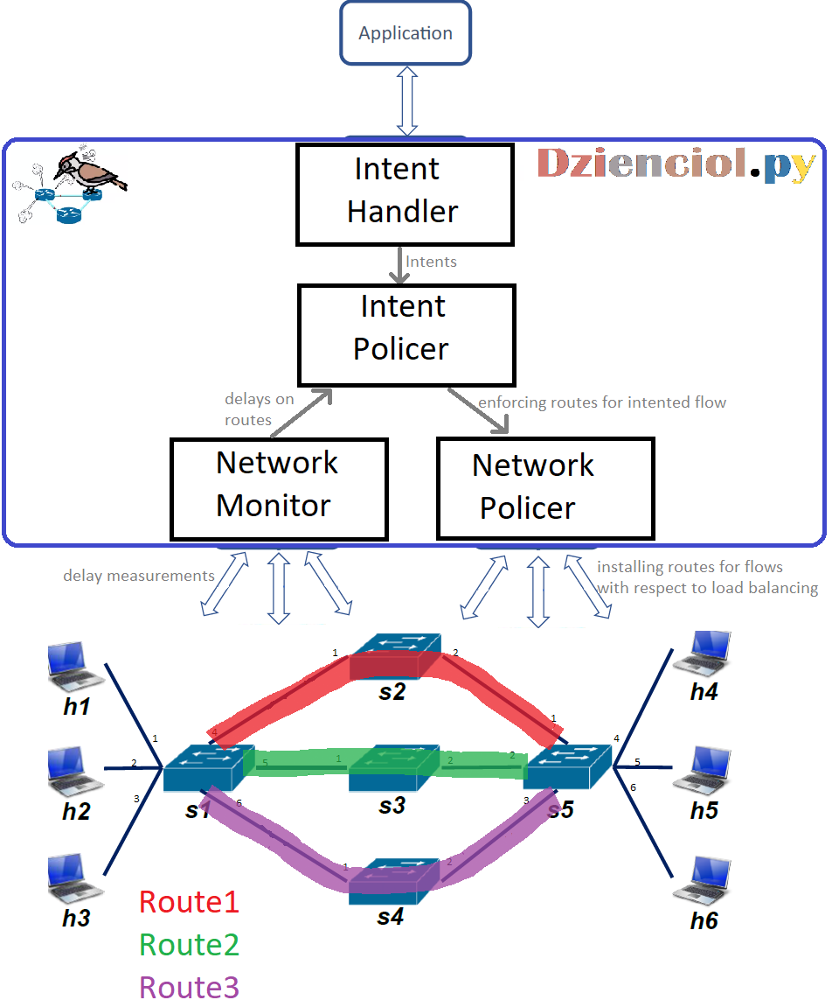

# Dzienciol.py architecture

## External Elements

### Application

Somethings that emulates the OSS/BSS system, from which an Intent can be sent. We've developed a python `application.py` script for such emulation. The usage of this script is described in [Run Guide](run_guide.md)

### Mininet network

Switches communicate with the Dzienciol via OpenFlow protocol. PACKET_IN messages are handed to the NetworkPolicer and OF messages, related to delay measurements are given to the NetworkMonitor. 

## Internal dzienciol architecture

### NetworkPolicer

Installs routes in all switches. NetworkPolicer solely independently manages the non-intented flows. NetworkPolicer is the component responsible for load balancing required in the project scope. NetworkPolicer can be requested by the IntentPolicer to force the given route for the intented flow. After such operation, NetworkPolicer needs to trigger its load balancing check, and potentially rearrange the flows distrbution.

### NetworkMonitor

Triggers the delay measurement procedure on routes 1, 2, 3. The procedure is based on the one used in lab1. NetworkMonitor at any given moment has the values of delays on each route and provides interface for such information. The measurement is triggered every 5 seconds.

### IntentPolicer

IntentPolicer is the only component that understands the Intent concept. Our project assumption is to keep track of only one intent. IntentPolicer gets an Intent, then checks appropriate route for it and enforces the route for the intented flow on the NetworkPolicer. After that IntentPolicer monitors intented flow via NetworkMonitor and takes apprioprate actions based on that (e.g., it can reroute the intented flow).

### IntentHandler

Listens for the intent request from the external application. IntentHandler is implemented as a TCP socket server (python “socket” lib). We can send an Intent as a string from our simulated application (script `application.py`). IntentHandler and application.py are deployed in a client-server manner.