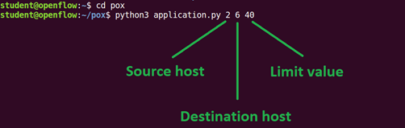

# Run Guide

## 1. Prepare the environmet

### 1.1 Prerequisites

First you need to have a VM with Mininet and POX installed (e.g. the machine used for lab1). 

## 1.2 Clone the repository

You can do it at any place, even Dekstop

```sh
git clone https://github.com/0x41gawor/eines-proj.git
```

### 1.3 Copy the files

`src` directory contains our code. 

The whole content of the `dzienciol` dir, should be placed in the pox directory `~/pox`

`application.py` and `topology.py` can be placed anywhere, in this example we will put them in `~/Dekstop` dir

## 2 Run the Mininet and Dzineciol controller

### 2.1 Run the mininet network

```sh
cd ~/Dekstop
sudo python topology.py
```

### 2.2 Run the Dzienciol Pox Component

```
cd ~/pox
sudo python pox.py dzienciol &
```

### 2.3 Run the Intent sending application

```
cd ~/Dekstop
python application <h1> <h2> <limit>
```

While the topology.py and pox.py start the remaining process, this script exits immediately after its use. So it can be used later during the experiment. You don't even need to run it to have fully working network. 

How to use it?



In this example, we will send the Intent saying that for the flow between H2 and H6 we want the maximum delay 40ms.

## 3 How to stop it

### 3.1 Stop the mininet network

```sh
mininet> exit
sudo mn -c
```

### 3.2 Stop the POX

First try multiple `ctrl+c`

```sh
ps -aux | grep pox
sudo kill -9 <pid1>
sudo kill -9 <pid2>
```


