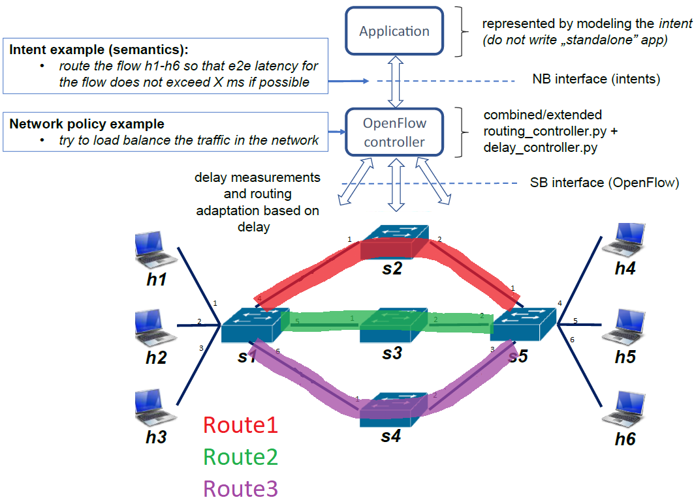
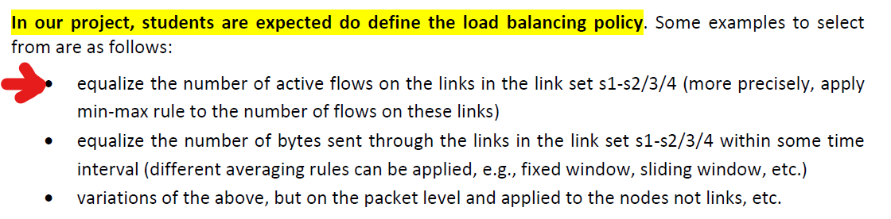
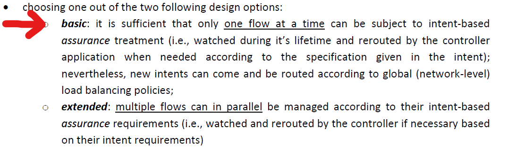
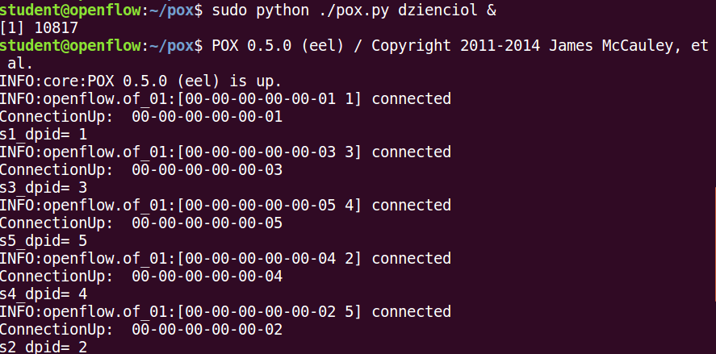
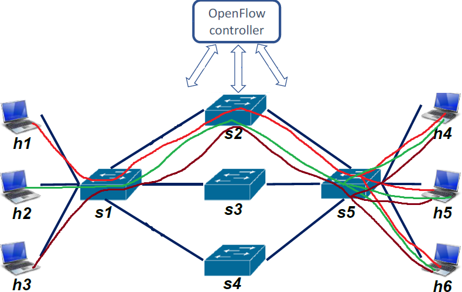
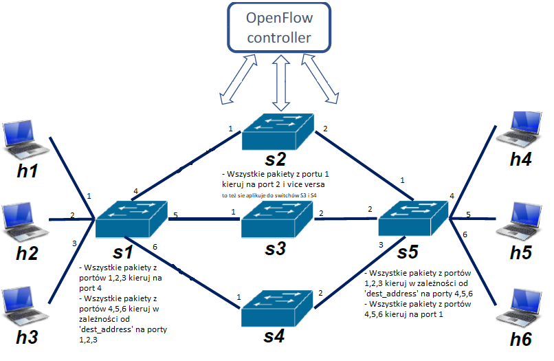

# Intro

Na rzecz projektu stworzymy komponent POX o nazwie `dzienciol.py`, który będzie implementował funkcjonalności wymagane w projekcie.

# Podjęte decyzje, poczynione założenia

## Intent model

```kotlin
class Inent{
  	var FROM: enum{H1, H2, H3}
	var TO: enum{H4,H5,H6}
	var LIMIT: Int 
}

```

Np.

```
Intent(FROM: H1, TO: H5, LIMIT: 60)
```

Reprezentuje Intent, który mówi, że dla flow H1->H5 max delay ma wynosić 60ms.

## Network policies

Network Policies mają load balancować ruch. Nasz load balancer będzie zachowywał się tak, że:

Defaultowo żadne flow* nie ma przypisanego route'a**. W momencie kiedy jakieś flow zaczyna być niezerowe (np. walniemy ping), to w Controllerze pojawi się wiadomość PACKET_IN. Naszym zadaniem jest teraz rozdawać rouety dla przychodzących flow, że każdy route będzie miał w miarę możliwość po równo flow'ów na sobie. Jak to zrobić?

Ustawiamy licznik dla każdego route'a i dajemy wartość 0. Przychodzi flow, to jak jest remis, dajemy na Route1 (do S1-S2). Potem robimy tak, żeby max róznica między licznikiem dla każdego route;a wynosiła 1. Cały ten algorytm będzie mieli w jednej funkcji, dla której triggerem może być albo PACKET_IN albo INTENT_IN lub INTENT_REROUTE. Czyli jak przyjdzie Intent i jego działanie nam "namiesza", to znaczy zrobi gdzieś różnicę 2, to te defaultowe flowy, musimy zrearanżować, żeby było git. Tak samo jak trzeba będzie zrerutować flow sterowane przez Intent (bo ruch w sieci zrobił tak, że obecna jego ścieżka już nie spełnia wymagań), to też trzeba będzie triggerować NetworkPolicer.

> *Jakie mogą być flow wgl? H1-H4, H1-H5, H1-H6, H2-H4, H2-H5, H2-H6, H3-H4, H3-H5H3-H6
>
> ** Jaki może być route wgl? S1-S2, S1-S3, S1-S4.
>
> Topologia
>
> 

Czyli wybieramy tę opcję



## One flow at a time



Mimo, iż druga opcja jest dużo bardziej naturalna, to programistycznie o niebo łatwiej będzie zrobić *basic*.

W zmiennej będziemy trzymać aktualnie intented flow oraz jego delay limit. 

# Architektura dzienciola

`dzineciol.py` to produkt, który będziemy tworzyć w ramach projektu

- Network Policer
  - będzie rerutował defaultowe flowy (flow moze być albo intented albo default) tak aby każdy route miał po równo flow
- Intent Policer
  - będzie monitorował i rerutował Intented flow a następnie triggerował Network Policer
- Intent Handler
  - będzie przyjmował request na intent i triggerował Intent Policer
- Network Monitor
  - Będzie monitorował jakie są delaye na rutach i ew. triggerował Intent jak wykryje nie spełnienie wymagań

# Release history of dzienciol.py

## Release 1

Kod dzienciola jest bardzo prosty, w zasadzie stanowi on podzbiór kodu `routing_controller.py`. Zachowana jest jedynie funkcjonalność handlowania połączeń ze switchami i wypisywania tego na konsolę. 



Tak, więc `dzienciol.py` posiada tylko funckję `_handle_ConnectionUp` oraz launch, które tę funkcję rejestruje w POX jako handler eventu "ConnectionUp".

Jak narazie `dzienciol.py` nie wstawia żadnych table flow entries do switchów wobec tego w sieci `topology.py` nie działają pingi pomiędzy hostami. 

Następnym krokiem jest sprawić, aby `dzienciol.py` wstawił jakikolwiek flow entry do switcha  i żeby dało się spingować jakikolwiek host.

> Tak się zastanawiam, że chyba skoro tylko lewa strona switchów ma obsługiwać intenty, to można na PACKET_IN dać jakiś behavior dla prawej strony i wgl niech defaultowo wszystko będzie na PACKET_IN jakimś hardcoded routingiem, a dopiero jak przyjdzie intent to będą zmiany.

# Future goals

1. Default flows 
2. Network Policer
3. Intent Handler
4. Network Monitor
5. Intent Policer

## 1. Default flows

### AS IS

Obecnie controller żadnemu ze switchy nie wpisuje żadnych table flow entries wobec tego ping między hostami nie działają.

### TO BE

Chcemy, aby każdy ze switchy otrzymał defaultowe ścieżki.

Tzn. gdy pojawi się pakiet i switch wyśle do dzienciola PACKET_IN, to żeby dzienciol mu odpowiedział defaultowym pathem. Narysujmy te ścieżki na topologii.



### Implementacja

Na to to się przekłada w flow table


